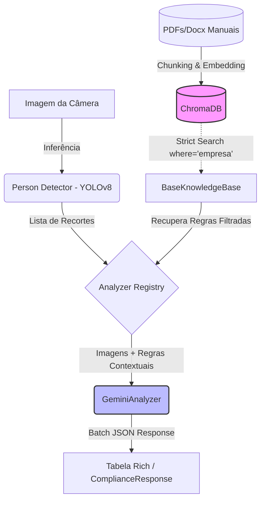

<!-- PROJECT LOGO -->
<br />
<div align="center">
  <h3 align="center">Argos</h3>

  <p align="center">
    Sistema Inteligente de Verificação de Conformidade Visual com RAG e Modelos Multimodais
    <br />
    <br />
    <a href="#usage">Ver Exemplo de Uso</a>
    ·
    <a href="#architecture">Arquitetura</a>
  </p>
</div>

<!-- TABLE OF CONTENTS -->
<details>
  <summary>Tabela de Conteúdos</summary>
  <ol>
    <li>
      <a href="#about-the-project">Sobre o Projeto</a>
      <ul>
        <li><a href="#built-with">Construído Com</a></li>
        <li><a href="#architecture">Arquitetura (Mermaid)</a></li>
      </ul>
    </li>
    <li>
      <a href="#getting-started">Como Começar</a>
      <ul>
        <li><a href="#prerequisites">Pré-requisitos</a></li>
        <li><a href="#installation">Instalação</a></li>
      </ul>
    </li>
    <li><a href="#usage">Uso</a></li>
    <li><a href="#contact">Contato</a></li>
  </ol>
</details>

<!-- ABOUT THE PROJECT -->
## Sobre o Projeto

Na mitologia grega, **Argos Panoptes** era o gigante de cem olhos que tudo via e nunca dormia. Este sistema empresta seu nome e sua essência: uma presença vigilante, incansável e precisa, que observa cada detalhe em busca da conformidade.

Regras de vestimenta, EPIs e uniformes mudam de empresa para empresa. Manter classificadores estáticos ou validações manuais é um ciclo caro e quebradiço. O **Argos** troca essa lógica por uma arquitetura multimodal que entende contexto, recupera as regras corretas e avalia cada pessoa com precisão — tudo em lote, em segundos, sem misturar informações entre clientes.

Cada decisão técnica foi tomada para equilibrar **custo, latência e confiabilidade**:

### Decisões Técnicas e Arquitetura Aplicada

1. **Visão Computacional Inicial (Fast & Local)**
   * **Tecnologia:** `YOLOv8n` + `OpenCV`
   * **O Porquê:** Modelos generativos são pesados e lentos para detectar pessoas e extrair coordenadas. O YOLOv8 Nano faz essa varredura em milissegundos, direto na CPU, sem depender de nuvem. Ele localiza cada pessoa na imagem, filtra o fundo e gera recortes limpos — o resto é processado seletivamente.

2. **Retrieval-Augmented Generation (RAG Restrito)**
   * **Tecnologia:** `ChromaDB` integrado ao modelo `all-MiniLM-L6-v2` (`SentenceTransformers`)
   * **O Porquê:** O desafio exigia isolamento total entre as regras de cada empresa. A busca vetorial no ChromaDB foi configurada com `where="empresa"` — um filtro rígido que impede que um manual contamine a análise de outro cliente. A LLM recebe apenas os 5 trechos mais relevantes **do contexto correto**, eliminando alucinações cruzadas e economizando janela de tokens.

3. **Orquestração GenAI e Lote de Avaliação (Batch Multimodal)**
   * **Tecnologia:** `Google Gemini 3.0 Flash` com *Structured Outputs*
   * **O Porquê:** Em vez de chamar a API para cada pessoa, o Argos monta **um único request com todas as imagens recortadas** e as regras recuperadas. A LLM processa tudo em lote e retorna um JSON estruturado (via Schema Restriction) com ID, status (`conforme`, `não conforme`, `indeterminado`) e justificativa. A latência despenca e o custo é drasticamente reduzido.

4. **Design de Engenharia de Software e Testes Mocks**
   * **Tecnologia:** `Pydantic`, `Pytest`, `Loguru` e Injeção de Dependências (DI)
   * **O Porquê:** O `main.py` não sabe o que é Chroma, YOLO ou Gemini. Ele conversa apenas com **interfaces abstratas**. Essa inversão de dependência permite trocar qualquer componente sem reescrever a orquestração. Os testes unitários (`pytest`) simulam o fluxo completo — incluindo chamadas à LLM — validando contratos sem gastar um centavo de API. Um arquivo `config.yaml` substitui "magic numbers" e centraliza os paths.

### Construído Com

* [![Python][Python.org]][Python-url] - Type Hints massivo, Pydantic e SOLID
* [![OpenCV][OpenCV.org]][OpenCV-url] - Manipulação e Crop de Bounding Boxes
* [![GoogleGemini][Google.com]][Gemini-url] - LLM Multimodal com Structured JSON Output
* [![ChromaDB][ChromaDB.com]][Chroma-url] - Banco de Dados Vetorial para RAG

### Arquitetura



## Como Começar

Siga os passos abaixo para configurar o ambiente e executar o pipeline de conformidade localmente.

### Pré-requisitos

* **Python 3.12+**
* Gerenciador de pacotes [`uv`](https://github.com/astral-sh/uv) (recomendado) ou pip
* (Opcional) **Nix**, para ambiente reprodutível via `shell.nix`

### Instalação

1. Clone o repositório
   ```sh
   git clone https://gitlab.com/leoni.frazao.oliveira/Argos.git
   cd Argos
   ```
   
2. Solicite uma API Key do Google Gemini no [Google AI Studio](https://aistudio.google.com/)

3. Crie um arquivo `.env` na raiz:
   ```env
   GEMINI_API_KEY="sua_chave_aqui"
   ```

4. Configure o ambiente virtual e instale as dependências:

   **Com Nix:**
   ```sh
   nix-shell
   ```

   **Com uv (recomendado):**
   ```sh
   uv sync
   ```

5. Certifique-se de que o modelo `yolov8n.pt` está no caminho configurado em `config.yaml` (ex.: `src/domain/models/yolov8n.pt`).

### Como Criar o Dataset

O sistema espera uma estrutura de diretórios específica dentro da pasta `dataset/` (ou o caminho configurado em `config.yaml`). Cada subdiretório dentro de `dataset/` representa uma **empresa** ou cliente diferente.

Para adicionar um novo dataset:

1. Crie uma pasta dentro de `dataset/` com o nome da empresa (ex: `dataset/Construtora_Alfa/`).
2. Adicione os manuais de conformidade, normas de vestimenta ou regras de EPI da empresa em formato **PDF** ou **DOCX** dentro dessa pasta. Estes documentos serão indexados automaticamente pelo sistema de busca vetorial (RAG).
3. Adicione as imagens (formatos **JPG**, **JPEG** ou **PNG**) das pessoas que deseja analisar dentro da mesma pasta.

**Exemplo de Estrutura:**
```text
dataset/
├── Construtora_Alfa/
│   ├── manual_epi_2024.pdf
│   ├── normas_vestimenta.docx
│   ├── funcionario1.jpg
│   └── grupo_operarios.png
└── Clinica_Beta/
    ├── regras_higiene.pdf
    └── equipe_medica.jpg
```

Dessa forma, o Argos garante que ao analisar as imagens da `Construtora_Alfa`, utilizará apenas as regras contidas em `manual_epi_2024.pdf` e `normas_vestimenta.docx`, sem misturar com as regras da `Clinica_Beta`.

## Uso

Com as dependências instaladas e a API Key configurada, execute o pipeline:

```sh
python main.py
```

**Exemplo de saída esperada no terminal:**

```bash
2026-03-26 21:00:10 | INFO     | indexado: manual.pdf | empresa: Construtiva Engenharia S.A (42 chunks)
2026-03-26 21:00:11 | INFO     | pessoas encontradas: 3
2026-03-26 21:00:15 | INFO     | analisando lote de 3 pessoas com o modelo gemini-3-flash-preview
2026-03-26 21:00:18 | INFO     | person_0 → conforme
2026-03-26 21:00:18 | INFO     | person_1 → não conforme
2026-03-26 21:00:18 | INFO     | person_2 → indeterminado
```

O resultado será exibido em uma tabela formatada com a biblioteca `Rich`, contendo o ID da pessoa, o status de conformidade (com cor) e a justificativa da análise.

## Contato

**Leoni Frazão** — leoni.frazao.oliveira@gmail.com

Link do Projeto: [https://github.com/leonifrazao/Argos](https://github.com/leonifrazao/Argos)


<!-- MARKDOWN LINKS & IMAGES -->
[Python.org]: https://img.shields.io/badge/Python-3776AB?style=for-the-badge&logo=python&logoColor=white
[Python-url]: https://www.python.org/
[OpenCV.org]: https://img.shields.io/badge/OpenCV-5C3EE8?style=for-the-badge&logo=opencv&logoColor=white
[OpenCV-url]: https://opencv.org/
[Google.com]: https://img.shields.io/badge/Gemini_API-8E75B2?style=for-the-badge&logo=google&logoColor=white
[Gemini-url]: https://aistudio.google.com/
[ChromaDB.com]: https://img.shields.io/badge/ChromaDB-FF4F00?style=for-the-badge&logo=chroma&logoColor=white
[Chroma-url]: https://www.trychroma.com/